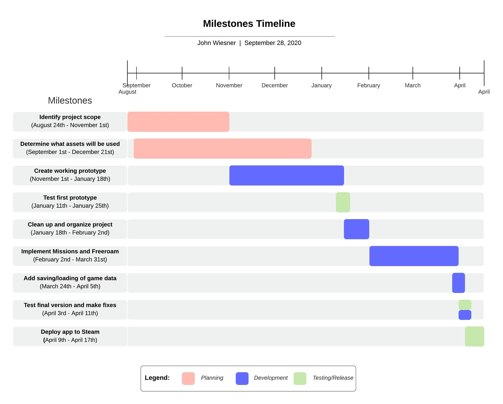

# VR Excavator Simulator

Table of Contents for Fall Design Report. View Direct [Assignments (1-8)](Assignments1-8.md) instead

- [Project Abstract](#project-abstract)
- [Project Description](#project-description)
  - [Purpose](#purpose)
  - [Goals](#goals)
- [User Stories and Design Diagrams](#user-stories-and-design-diagrams)
  - [User Stories](#user-stories)
  - [Design Diagrams](#design-diagrams)
  - [Description of Design Diagrams](#description-of-design-diagrams)
- [Project Tasks and Timeline](#project-tasks-and-timeline)
  - [Task List](#task-list)
  - [Timeline](#timeline)
  - [Effort Matrix](#effort-matrix)
  - [Milestones](#milestones)
- [PPT Slideshow](#ppt-slideshow)
- [Self-Assessment Essays](#self-assessment-essays)
- [Professional Biography](#professional-biographies)
- [Budget](#budget)
  - [Expenses](#expenses)
  - [Donations](#donations)
- [Appendix](#appendix)
  - [References](#references)
  - [Possible Assets](#possible-assets)
  - [Time Logs](#time-logs)

# Project Abstract

Team Members

- **Team member**: John Wiesner (CS) - wiesnejt@mail.uc.edu
- **Advisor**: Kyle Hartshorn (Group Manager at Kinetic Vision) - khartshorn@kinetic-vision.com

The Virtual reality excavator simulator application will allow users to learn the fundamentals of excavation-machine operation and control patterns. User will be taught these topics through missions such as land clearing, pond excavation, and covert installation. It will be designed for the game library Steam, targeted at windows 10 computers that support VR devices; specifically the Oculus Rift.

# Project Description

## Purpose

- Create an excavator simulator that educates users while maintaining a fun game-like environment
- Allow people who do not have access to excavation equipment to learn/emulate how to operate heavy machinery
- Provide educational entertainment via virtual reality
- Fill a gap in the market since there are no other Steam VR excavator simulators that attempt to mimic reality

## Goals

- Learn the entire process of designing, implementing, testing, and publishing a Steam game.
- Create a fun-to-play simulator/game for VR users.
- Allow users to mess around with excavators and the excavation of dirt in real-time.
- Learn how to manage a larger project

# User Stories and Design Diagrams

## User Stories

1. As a VR user, I want to play a game sitting down so that I can take a break from most of the standing VR games available.

2. As an excavation expert, I want to be able to switch control configurations (ISO and SAE), so that I can learn how to operate different machine models.

3. As a person who has played simulator games before, I want to be able to move around a open world map with optional tutorials/levels, so that I have the choice on how I play in the order I choose.

4. As a person who is new to VR and knows nothing about excavators, I want to follow a short tutorial on the controls and operations, so that I am not confused and just get frustrated.

5. As someone who only owns a VR system, I want to be able to play the simulator with all it’s features, so that I do not miss out on features of the game for not having the correct hardware.

## Design Diagrams

- [View PDF](Documentation/Design_Diagrams/Design-Diagrams-012.pdf) Levels 0,1,2

## Description of Design Diagrams

### D0

1. A Virtual reality user opens steam and launches the simulator. They use the program and then learn more about excavator operation

### D1

1. Person with an Oculus rift uses buttons that trigger events. These events control menus and excavation functions. Once a menu displays a user points the controller at where they want to navigate and then pull the front trigger.
2. If user holds clutch button and rotates controllers, excavator function will move dependent on user settings
3. If a user moves the right or left joystick (forwards or backwards) the excavator tracks move with a certain force proportional to the input magnitude.
4. An Oculus controller passes input events to Steam-VR that then get passed to the Unity Engine. They are then handled as events within the game engine to preform certain event driven tasks.

### D2

1. A person with an Oculus Rift and two controllers starts the simulator up. The Unity engine stats, then Steam VR, and the main menu is loaded
2. If the user has save data in a slot, that slot button is enabled.
3. User points at the button "Quit" and pulls the trigger. Simulator shuts down.
4. User points at play, the menu prompts user to select a save slot, save data is generated, free roam is entered
5. User selects load save #, Save data is validated and loaded if valid else it generates new data.
6. Menu button is pressed.
7. User presses Quit and progress is saved and user it taken to main menu.
8. User clicks on settings, settings menu opens and can be configured
9. User clicks resume, game menu closes and game resumes.
10. User clicks missions.
11. Missions are displayed.
12. User clicks on Tutorial mission, and the corresponding stages are displayed
13. User clicks on Create a Pond, and the corresponding stages are displayed

# Project Tasks and Timeline

## Task List

Since this is a **solo team, John Wiesner** will be working on all of the tasks.

1. (John) [X] Research on what is the best real-time dirt simulation technology to use within Unity.
2. (John) [X] Research how to build a Steam app.
3. (John) [X] Design Missions (Tutorial and Pond) and their stages in great detail (on paper).
4. (John) [X] Design free roam terrain and what objects will be present in the map (on paper).
5. (John) [X] Create a list of what asset will be needed for the project and the cost associated with them (Models, Textures, Icons).
6. (John) [ ] Design basic user interface layout and figure out what icons will be used.
7. (John) [ ] Set up SteamVR in Unity 2020 and get Oculus controls working.
8. (John) [ ] Apply for Steamworks developer
9. (John) [ ] Add steam API: Steamworks.NET and create a build for steam.
10. (John) [ ] Program excavator-like controls and control an excavator model.
11. (John) [ ] Program basic implementation of digging/placing dirt with excavator.
12. (John) [ ] Program grabbing objects with excavator thumb.
13. (John) [ ] Program the falling of trees.
14. (John) [ ] Implement world-space user interface menus (Main menu, Settings, Missions).
15. (John) [ ] Set up basic testing area and get at least one person to test simulator and to document their feedback (ideally on different hardware too).
16. (John) [ ] Tweak current systems to accommodate tester’s feedback.
17. (John) [ ] Swap out free assets for paid assets (only if necessary).
18. (John) [ ] Create tutorial mission stages (Basic controls, Excavating tutorial, pick/place objects tutorial).
19. (John) [ ] Create pond mission stages (Remove trees, remove large boulders, dig pond, dig covert pipe, cover pipe with dirt, place in riprap).
20. (John) [ ] Implement save/load of data (Settings, Missions completed,Mission progress, dirt moved, objects moved).
21. (John) [ ] Add three save slots on main menu.
22. (John) [ ] Test simulator and fix bugs that appear.
23. (John) [ ] Have one newer person test simulator and one or more other people test the simulator (Possibly on different hardware).
24. (John) [ ] Preform final tweaks, bug fixes, changes and then test 2 more times.
25. (John) [ ] Publicly release app on steam.

## Timeline

[View PDF](Documentation/Timeline-And-Effort-Matrix.pdf)

## Effort Matrix

[View PDF](Documentation/Timeline-And-Effort-Matrix.pdf)

## Milestones

See timeline below

1. **Identify project scope**

    Determine what the simulator will have in it. Determine what missions/levels can a person play and what each stage of the mission is.

2. **Determine what assets will be used**

    Determine how much each asset will be and where it is coming from. See list below ordered in importance:

    - Technology assets (digging terrain, Steam publishing)
    - Models (excavator, rocks, buildings, etc)
    - Textures
    - Sounds
    - Music
  
3. **Create working prototype**

    Create a prototype app that works well enough to get the basics working. This is meant to be a quick and dirty implementation to get the technologies working together.

    Complete this list of tasks in order:

    - Create Steamworks account and page
    - Create Unity project with SteamVR and SteamWorks API
    - Get VR headset working in Unity
    - Set up flat freeroam area with controllable excavator
    - Add basic excavator functionality (Digging, Grabbing, Moving)
    - Add basic menu navigation

4. **Test first prototype**

    Make sure the first proof of concept design mimics a real life excavator and that it "feels playable".

5. **Clean up and organize project**

    Take the findings in the prototype stage and implement them in organized and clean way. The code and project should be maintainable and organized.

6. **Implement Missions and Freeroam**

    - Set up a missions and stages framework for project
    - Implement the tutorial mission and its stages
    - Implement the pond mission and its stages
    - Add a few objects to freeroam mode (cars, tires, bricks, etc) that player can grab and move

7. **Add saving/loading of game data**

    This allows a user to save the progress of a mission or stage so they can continue at a later date. Terrain and objects should be saved within missions but the freeroam mode will not have and saving states.

8. **Test final version and make fixes**

    Stress test the simulator on different hardware using different people. Note down any bugs or flaws found during this stage. Fix any major outstanding bugs or issues.

9. **Deploy app to Steam**

    Release VR excavator simulator game on steam as a alpha/beta app. The app will most likely be free while in the beta stages.

# PPT Slideshow

- [Presentation Video](https://youtu.be/ZOa90eH4KTM)
- [Slides](https://docs.google.com/presentation/d/1asnYs52KmI7KF5HLWeHoiBWRCJnixCsJY4od4XY2zRM/edit?usp=sharing)

# Self-Assessment Essays

## Introduction

When deciding on a topic for my senior-design project I wanted to choose something that would challenge me. I also wanted to choose a project that would allow me to apply what I have learned both in class and while on co-op. I will be taking the material I have learned while in class and apply it to real-world applications. The project I decided is to create a **virtual reality (VR) excavator simulator** that will be made public **on the Steam store**. This VR simulator allows me to improve my overall development skills from scoping, design, planning, implementation, polish, and publication. I will be completing this project as a one-person team because I felt that I should not rely on other team members to showcase the skills I have learned over the past five years of school and five co-op semesters.

## College Curriculum

The college curriculum will help guide my development process by giving me the steps needed to plan out a successful and completable project. After taking generic programming classes like **CS4003** Programming Languages, I know I prefer programming in C++ or C#. This allows me to use the game engine Unity3D since all the coding is done in the language C#. I then will use the strategies and architecture I learned in the classes **EECE3093C** Software Engineering and **CS5127** Requirements Engineering to scope out the project. It is important to get requirements of what the software/program will do before programming even starts. The **CS5167** User Interface class I took will allow me to create a simple but effective user interface and (in game) heads up display. I will also use knowledge from the class **CS2028C** Data Structures when storing level information, user statistics, and save data. Another smaller point I want to bring up is that depending on the required math for equipment controls I may end up using math learned in the class **Math2076** Linear Algebra. The final two classes, **ENGL4092** Technical and Scientific Writing and **Comm1071** Intro to Effective Speaking, will help my final presentation and documentation of this project.

## Co-op Experiences

My co-op experiences from Kinetic Vision will help guide the development of my senior project. The **advisor** I chose to oversee my project is **Kyle Hartshorn**, a group manager of the virtual + interactive solutions team at **Kinetic Vision**. Since I mostly got to develop mobile apps within Unity while at Kinetic Vision, I understand the fundamentals of the Unity game engine. My interest in VR has come from the last half of this past co-op semester since I helped out on a larger VR project. VR intrigued me and I wanted to spend more time learning the whole development process of creating a VR application outside of working on an already well-established project. I also will be able to apply my knowledge gained about programming best practices and source control. I learned most of these practices from **Eric Phillips** and **Berell McClellan** who are both software engineers at Kinetic Vision. Although I have not been part of the planning stages for most projects at Kinetic Vision, I was able to pick up some important development steps that I can apply to my senior design project. I have also learned many non-technical skills. Some of these include how to create deliverables, convey important changes to clients, how to manage time and budget, meet strong deadlines, and how to receive/implement constructive criticism of a project or feature.

## Motivation

My motivation for creating a VR excavator simulator is due to me being **fascinated with excavators and heavy machinery** but also my curiosity of VR development and publication. I also want to go to a place called [Extreme Sandbox](https://www.extremesandbox.com/gallery/) but it is located far away from Ohio so making this simulator will allow people from all over the world to experience an excavator. When researching to see if there were other VR excavator simulators, **I was unable to find any that the public was able to use within VR**. Most of them required one or more of the following: multi-monitors, custom hand joysticks, foot pedals, custom chair rig, and/or physically going to a simulator’s location for use. I want to create a simulator that only uses common VR devices (Ideally Oculus) with no extra equipment or controllers. The simulator should also be accessible to the public for free or behind a small paywall (ideally through the application library, Steam). Producing this type of application will also broaden my knowledge of game publication, production, and prototyping. This allows me to fully understand the whole process instead of just the programming aspect.

## Preliminary Project Approach

The first steps I plan on taking for this project is to **find** as many **other examples** of excavation mechanics. These mechanics could include digging, moving, particle simulation, rig attachments, optimizations, and procedures. One example I was able to find is a [short video](https://www.youtube.com/watch?v=TkiekFf5970&feature=youtu.be&t=83) by CM Labs. Once I find what the best implementation and limitations will be, I can then **scope out a high-level application design document** that describes what the deliverables will be. Completing these predetermined deliverables is what determines the application progress. In general, these deliverables will be a fully working Steam application that allows a user to use an excavator in VR. Some examples of these deliverables: the user can dig/fill holes, dispose of dirt into trucks, complete four or five pre-determined tutorial levels (learning controls, clear land of trees and boulders, dig a pond, install a covert pipe), switch control modes ([ISO and SAE](https://en.wikipedia.org/wiki/Excavator_controls#:~:text=The%20most%20commonly%20used%20control,motions%20(close%20%26%20dump))), and possibly switch buckets (2 variants). **To determine if I did a “good job” I would analyze what I learned, what mistakes did I do, what did I do great, and is the project stable/useable by the public.**

# Professional Biography

## John Wiesner

## Contact

- Name: John Wiesner
- Email: Wiesnejt@mail.uc.edu
- Phone: (513) 560-8993
- Website: MrJohnWeez.com

## Co-op Work Experience

### Software Engineer, Kinetic Vision Evendale Ohio. (Fall 2017 - Present)

- Lead developer on a few Unity 3D mobile applications
- Started and maintained Android game with custom hardware for 3 years
- Worked on augmented and virtual reality projects within Unity3D
- Updated Unity3D applications with custom hardware
- Preformed and developed QA testing for many applications
- Built team best practices
- Worked with many different teams
- Updated and debugged iOS apps
- 3D motion track recording within Unity3D
- Developed plugins for game engines Unreal and Unity

## Expertise Areas

- Programming: C#, C++, Python
- Programs: Unity3D, Git, SourceTree, GitKraken, Gimp, Corel video studio x8
- Technologies: ARkit, ARcore, Android peripherals
- Operating Systems: Windows, Mac, Android, iOS
- Office Applications: Google Docs/Sheets/Slides, Microsoft Office

## Areas of Interest

- Simulations
- Virtual reality (VR)
- Augmented reality (AR)
- Two- and three-dimensional Unity games

## Project Sought

- A windows application within Unity that is a VR simulation game or a teaching game
- Physics or kinematics-based movement
- Publish a free product on steam

# Budget

This project will have a budget of around $200 **(using personal funds)**. This is due to needed realtime terrain modification which is a Unity asset for $90 and the cost of putting an application on Steam ($100 publication fee). The goal is to sell the game on Steam in an attempt to recover some of this cost and/or find a sponsor who would donate money to the project. This sponsor's logo/name would be presented within the application as a thank you.

All other models, sounds, textures, code libraries will be open sourced or commercial licence assets. The hardware used to develop this software was already pre-purchased for a different personal use. This hardware includes an Oculus Rift, Controllers, Monitors, and VR-ready PC. All development can be done via John's home (Since he is the only member for this project).

## Expenses

- $90 [Realtime terrain asset for Unity](https://assetstore.unity.com/packages/tools/terrain/digger-pro-149753)
- $100 [Steam Publication Fee](https://store.steampowered.com/sub/163632/)

## Donations

Send donations to *MrJohnWeez* help improve this project

Be the first to [Donate](https://www.paypal.com/paypalme/mrjohnweez)

# Appendix

[Code Repo](https://github.com/MrJohnWeez) COMING SOON SPRING 2021!

## References
- [Preparing your Unity game for Steam](https://www.youtube.com/watch?v=o5-Y-5Dtg_c)
- [Steamworks](https://steamworks.github.io/)
- [Excavator controls](https://en.wikipedia.org/wiki/Excavator_controls#:~:text=The%20most%20commonly%20used%20control,motions%20(close%20%26%20dump).)
- [Extreme Sandbox](https://www.extremesandbox.com/gallery/)
- [Excavator Simulator Training Pack | Construction Simulator - CM Labs](https://www.youtube.com/watch?v=TkiekFf5970&t=83s)
- [How the controls in an excavator work](https://www.youtube.com/watch?v=VKWaFoglX70)
- [Today Is Demo Day!](https://www.youtube.com/watch?v=RIHbu3m7uxk)

## Possible Assets
- [Unity excavator](https://unitylist.com/p/ytr/Unity-excavator)
- [Excavators Komatsu Low-poly 3D model](http://cgnulled.com/cgtrader-excavators-komatsu-low-poly-3d-model/)
- [Animated Excavator](https://sketchfab.com/3d-models/animated-excavator-54a03fc0f1714b5db7c0cb7cbf08d605)
- [Digger](https://sketchfab.com/3d-models/digger-a77f7ec0f2124443a627b1d88bce2b82)
- ...[View all](https://docs.google.com/spreadsheets/d/1eKd5l_Gw6t07-m7JcUlSQY1MQcM6eC-xClxyQcX78QA/edit?usp=sharing)

## Time Logs

- [View Commits](https://github.com/MrJohnWeez/VR-Excavator-Simulator/commits/master)
- Time spent
  - 20 hours - Identify Scope and preform research
  - 20 hours - Determine what assets will be used
  - 30 hours - Create Prototypes and research best ways to implement possible features
  - 20 hours - Project [Assignments (1-8)](Assignments1-8.md)
