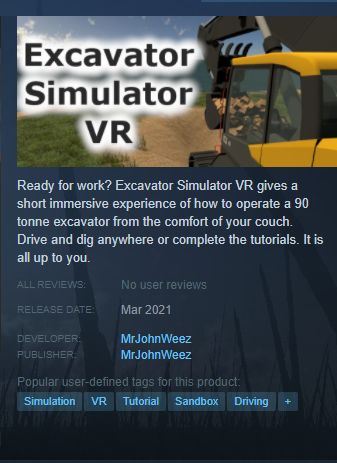
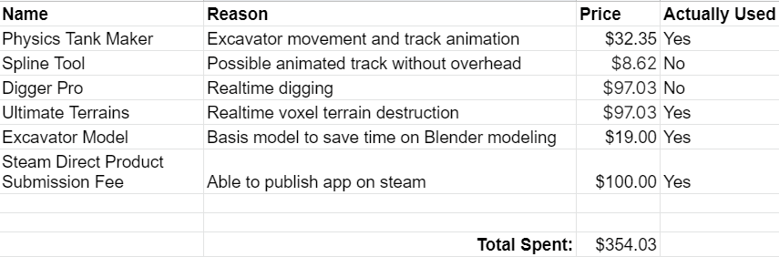

# VR Excavator Simulator Final Design Report

[PLAY ON STEAM TODAY!](https://store.steampowered.com/app/1526380/Excavator_Simulator_VR/)

---

## Table of Contents

- [VR Excavator Simulator Final Design Report](#vr-excavator-simulator-final-design-report)
  - [Table of Contents](#table-of-contents)
- [Project Description](#project-description)
    - [Short Description](#short-description)
  - [Long Description](#long-description)
- [User Interface Specification](#user-interface-specification)
- [Test Plan and Results](#test-plan-and-results)
- [User Manual](#user-manual)
  - [Assignment 2 User documentation and Manual](#assignment-2-user-documentation-and-manual)
  - [Game Trailer](#game-trailer)
  - [Getting started](#getting-started)
    - [Hardware requirements](#hardware-requirements)
    - [Installation](#installation)
    - [Run Simulator App](#run-simulator-app)
  - [How to play Excavator Simulator VR](#how-to-play-excavator-simulator-vr)
    - [Navigating menus](#navigating-menus)
    - [Game Controls](#game-controls)
      - [Seat Controls](#seat-controls)
      - [Excavator Controls](#excavator-controls)
  - [FAQ](#faq)
- [Final PPT Presentation](#final-ppt-presentation)
- [Final Expo Poster](#final-expo-poster)
- [Assessments](#assessments)
  - [Initial Self-Assessment (Fall Semester)](#initial-self-assessment-fall-semester)
    - [Introduction](#introduction)
    - [College Curriculum](#college-curriculum)
    - [Co-op Experiences](#co-op-experiences)
    - [Motivation](#motivation)
    - [Preliminary Project Approach](#preliminary-project-approach)
  - [Final Self-Assessment (Spring Semester)](#final-self-assessment-spring-semester)
    - [Individual Contribution](#individual-contribution)
  - [Learning Process](#learning-process)
  - [What Was Accomplished?](#what-was-accomplished)
  - [Effort Put In?](#effort-put-in)
- [Summary of Hours and Justification](#summary-of-hours-and-justification)
  - [Fall](#fall)
  - [Spring](#spring)
- [Summary of Expenses](#summary-of-expenses)
- [Assignments View](#assignments-view)

# Project Description

### Short Description

A virtual reality simulation game, available on Steam, that allows users to become familiar with excavator controls, movement, and excavation. Move around, dig terrain, and destroy objects. It is all up to the user. More accessible than current proprietary simulators.

## Long Description

Excavator Simulator VR is a short showcase of what it feels like to operate a giant 90-tonne excavator in either ISO or SAE control patterns. This includes real-time digging, boom/bucket movement, and tank-like movement. Explore levels to climb up hills or dig a giant hole. There are no limits even if you prefer not to complete the levels.

​Ever wondered what the difference between heavy machinery controls is or want to improve your excavation skills while in the office? After a few hours of gameplay, you will be the best virtual operator there is. You will be able to control an excavator in either ISO and SAE control patterns without hesitation.

​Want to dig a hole or go swimming in your excavator? Nothing is stopping you from doing anything. Go dig that swimming pool of your dreams or pile up a mountain of dirt.

No extra hardware is required. If you have a VR headset compatible with SteamVR, then you have a virtual cab and can interact with joysticks and levers using your virtual work gloves. You do not even need to have audio speakers as there is no audio currently in the game.

It is suggested to sit in a chair while playing this game to reduce the potential for motion sickness. Similar guidelines as racing VR games.

**Note that this game is mostly intended for showcase and education purposes so it only contains three tutorial levels all of which are open worlds (meaning you are not limited by the tutorial itself).*

***This game is not a substitute for proper excavation training and is only intended as an introductory course on the basics of excavator controls. Virtual training may aid in actual excavator operation.*

# User Interface Specification

The user interface is based on a laser pointer system that the user can interact with world-space buttons. This creates a immersion factor even while navigating menus.

Each tutorial level has specific instructions that a user can follow if they so choose to do so.

# Test Plan and Results

To fully test each build of this application a simple chart was made shown below. Each test had a test name, the actions for a user to preform, the expected result, and did the test pass by getting the expected outcome. These tests were manually preformed by myself and by other volunteers (beta testers). Any issues (failed test cases) were addressed and fixed. All tests would then be preformed again.

# User Manual

## Assignment 2 User documentation and Manual

Welcome to the user documentation for the app: Excavator Simulator VR. There is not a whole lot of documentation yet due to the app being actively developed. The guides below may be out of date and if so please submit a issue ticket.

## Game Trailer

[View Trailer](https://youtu.be/ad5y99QEyfQ)

## Getting started

### Hardware requirements
* SYSTEM REQUIREMENTS
  * MINIMUM:
    * OS: Windows 10
    * Processor: Intel i5-4590 | AMD Ryzen 5 1400
    * Memory: 8 GB RAM
    * Graphics: NVIDIA GTX 1060 | AMD Radeon RX 480
    * DirectX: Version 11
    * Storage: 1 GB available space
* RECOMMENDED:
    * OS: Windows 10
    * Processor: Intel Core i7-10750 | Ryzen 7 4800H
    * Memory: 16 GB RAM
    * Graphics: NVIDIA RTX 2060 | AMD Radeon Vega 56
    * DirectX: Version 11
    * Storage: 1 GB available space
* A VR device (Any device that works with Steam VR)

### Installation
1. Create a Steam account [Go to site](https://store.steampowered.com/login/?redir=&redir_ssl=1&snr=1_4_4__global-header)
2. Download and sign into Steam on a Windows 10 PC/Laptop [Download](https://store.steampowered.com/about/)
3. In the search bar type "Excavator Simulator VR" or view Steam page [Excavator Simulator VR](https://store.steampowered.com/app/1526380/Excavator_Simulator_VR/)
   
4. Hit add to cart and purchase (or add to wishlist if not available for purchase)
5. Download and install Steam VR [Download Steam VR](https://store.steampowered.com/app/250820/SteamVR/)
6. Download and install Excavator Simulator VR and press play
   

### Run Simulator App

1. Once Steam VR and Excavator Simulator VR has been installed just press play on Excavator Simulator VR
2. Steam VR should also start up

## How to play Excavator Simulator VR

### Navigating menus

1. Press the in game menu button on your controller.
2. A menu will be displayed on the excavator windshield.
3. Point your controller at the menu and a pointer will appear coming out of your hand.
4. Find a menu item to press and pull the trigger to click.
5. Press the in game menu button on your controller again to exit the menu or press the X button on the in game HUD.
   
### Game Controls

#### Seat Controls

#### Excavator Controls

Hover controller hand over the joysticks or levers and a hint will show what button to press

When the grab button is held in your hands snap to the red highlighted object and you can move the controller around to move the joysticks or levers

* Lever controls are introduced as the first tutorial level
  * Left lever = left track
  * Right lever = right track
* Joysticks and corresponding control pattern (ISO) are shown to the user as a hud while completing the joystick tutorial level.

    

## FAQ
Steam VR did not start up when Excavator Simulator VR app was started

* Make sure Steam VR has been installed and can be ran manually
* [Visit Steam VR's trouble shooting tips](https://support.steampowered.com/kb_article.php?ref=8566-SDZC-9326#:~:text=As%20a%20last%20resort%20for,Box%20cables%20from%20your%20PC.&text=Make%20sure%20the%20link%20box's,%2C%20and%20re%2Dlaunch%20SteamVR.)

I bought the game but it is laggy or unplayable

* Make **sure you meet the minimum hardware requirements** listed above or on the Steam store page.
* Please create a community post or **bug report** with what hardware you are running

* If you do not want to wait for a patch you can return the game to steam

I have played SteamVR game in the past but my controllers are not working

* Sometimes antivirus interferes with new Steam games. [See post](https://support.steampowered.com/kb_article.php?ref=4361-MVDP-3638)

I found a bug

* Please submit a bug report in the discussions tab
  
  

# Final PPT Presentation
- [Final PPT Presentation](https://www.mrjohnweez.com/excavator_sim_vr.html)

# Final Expo Poster
- [Final Expo Poster](https://www.mrjohnweez.com/excavator_sim_vr.html)

# Assessments

## Initial Self-Assessment (Fall Semester)

### Introduction

When deciding on a topic for my senior-design project I wanted to choose something that would challenge me. I also wanted to choose a project that would allow me to apply what I have learned both in class and while on co-op. I will be taking the material I have learned while in class and apply it to real-world applications. The project I decided is to create a **virtual reality (VR) excavator simulator** that will be made public **on the Steam store**. This VR simulator allows me to improve my overall development skills from scoping, design, planning, implementation, polish, and publication. I will be completing this project as a one-person team because I felt that I should not rely on other team members to showcase the skills I have learned over the past five years of school and five co-op semesters.

### College Curriculum

The college curriculum will help guide my development process by giving me the steps needed to plan out a successful and completable project. After taking generic programming classes like **CS4003** Programming Languages, I know I prefer programming in C++ or C#. This allows me to use the game engine Unity3D since all the coding is done in the language C#. I then will use the strategies and architecture I learned in the classes **EECE3093C** Software Engineering and **CS5127** Requirements Engineering to scope out the project. It is important to get requirements of what the software/program will do before programming even starts. The **CS5167** The User Interface class I took will allow me to create a simple but effective user interface and (in game) heads up display. I will also use knowledge from the class **CS2028C** Data Structures when storing level information, user statistics, and save data. Another smaller point I want to bring up is that depending on the required math for equipment controls I may end up using math learned in the class **Math2076** Linear Algebra. The final two classes, **ENGL4092** Technical and Scientific Writing and **Comm1071** Intro to Effective Speaking, will help my final presentation and documentation of this project.

### Co-op Experiences

My co-op experiences from Kinetic Vision will help guide the development of my senior project. The **advisor** I chose to oversee my project is **Kyle Hartshorn**, a group manager of the virtual + interactive solutions team at **Kinetic Vision**. Since I mostly got to develop mobile apps within Unity while at Kinetic Vision, I understand the fundamentals of the Unity game engine. My interest in VR has come from the last half of this past co-op semester since I helped out on a larger VR project. VR intrigued me and I wanted to spend more time learning the whole development process of creating a VR application outside of working on an already well-established project. I also will be able to apply my knowledge gained about programming best practices and source control. I learned most of these practices from **Eric Phillips** and **Berell McClellan** who are both software engineers at Kinetic Vision. Although I have not been part of the planning stages for most projects at Kinetic Vision, I was able to pick up some important development steps that I can apply to my senior design project. I have also learned many non-technical skills. Some of these include how to create deliverables, convey important changes to clients, how to manage time and budget, meet strong deadlines, and how to receive/implement constructive criticism of a project or feature.

### Motivation

My motivation for creating a VR excavator simulator is due to me being **fascinated with excavators and heavy machinery** but also my curiosity of VR development and publication. I also want to go to a place called [Extreme Sandbox](https://www.extremesandbox.com/gallery/) but it is located far away from Ohio so making this simulator will allow people from all over the world to experience an excavator. When researching to see if there were other VR excavator simulators, **I was unable to find any that the public was able to use within VR**. Most of them required one or more of the following: multi-monitors, custom hand joysticks, foot pedals, custom chair rig, and/or physically going to a simulator’s location for use. I want to create a simulator that only uses common VR devices (Ideally Oculus) with no extra equipment or controllers. The simulator should also be accessible to the public for free or behind a small paywall (ideally through the application library, Steam). Producing this type of application will also broaden my knowledge of game publication, production, and prototyping. This allows me to fully understand the whole process instead of just the programming aspect.

### Preliminary Project Approach

The first steps I plan on taking for this project is to **find** as many **other examples** of excavation mechanics. These mechanics could include digging, moving, particle simulation, rig attachments, optimizations, and procedures. One example I was able to find is a [short video](https://www.youtube.com/watch?v=TkiekFf5970&feature=youtu.be&t=83) by CM Labs. Once I find what the best implementation and limitations will be, I can then **scope out a high-level application design document** that describes what the deliverables will be. Completing these predetermined deliverables is what determines the application progress. In general, these deliverables will be a fully working Steam application that allows a user to use an excavator in VR. Some examples of these deliverables: the user can dig/fill holes, dispose of dirt into trucks, complete four or five pre-determined tutorial levels (learning controls, clear land of trees and boulders, dig a pond, install a culvert pipe), switch control modes ([ISO and SAE](https://en.wikipedia.org/wiki/Excavator_controls#:~:text=The%20most%20commonly%20used%20control,motions%20(close%20%26%20dump))), and possibly switch buckets (2 variants). **To determine if I did a “good job” I would analyze what I learned, what mistakes I do, what did I do great, and is the project stable/usable by the public.**

## Final Self-Assessment (Spring Semester)

### Individual Contribution

Since I worked on my senior design project by myself I was **responsible for every task**. These tasks ranged from 3d modeling, project planning, and programming to user testing, Steam publishing, and promotion material designer. This semester I applied and built upon my skills as a developer and as a game designer. Last fall semester, I identified what I hoped to learn from this project:

*“Producing this type of application will also broaden my knowledge of game publication, production, and prototyping. This allows me to fully understand the whole process instead of just the programming aspect”. ~John Wiesner last fall*

The **prototyping stage for this project took a whole lot longer** than I initially expected. It was about double the effort when viewing the number of hours the project took. I was able to learn better ways to estimate hours and how to focus effort where it counted the most. Even though I would have given up on the project multiple times over if it were not for a school assignment, I would not change a single process. I learned so much throughout the process, even the frustrating nights were worth every hour spent. The whole pipeline of developing a Steam game that hundreds of users could play without running into troubles was **stressful at times** but was very rewarding in the end when users actually downloaded the application. I can confirm that I have broadened my knowledge of game production and publication since I was able to release a fully playable and purchasable VR game. It was very rewarding to follow all aspects of game development and not just focused on the main programming objective.

## Learning Process

By the end of the senior design project deadline I was able to release a fully playable and purchasable SteamVR game. I **reached my main goal of releasing a Steam game** but it was a rough road to get there. I had to spend twenty to thirty hours a week to make large amounts of progress throughout the semester. As a rough outline on the process I took on creating the Excavator Simulator VR game is as follows:

1. Configured SteamVR and got headset tracking in 3D space
2. Bought and implemented mesh terrain system for realtime digging
3. Bought and modified excavator model
4. Setup VR space within excavator model
5. Implemented joystick and lever interactions
6. Added excavator movement
7. Bought and implemented voxel terrain systems for more performant digging system
8. Heavily optimized geometry and shaders
9. Added laser pointer menu system
10. Created three tutorial levels
11. Tested and bug fixes
12. User feedback
13. Created Steam page and promotional material
14. Tested and bug fixes
15. User feedback
16. Release

The accomplishments from this project were:
* I created a **fully playable and purchasable Steam game**.
* The VR game was fully optimized so that it can run on minimum hardware specs.
* I created three tutorial levels that showcase basic functionality of an excavator.
* An interactive digging of dirt mechanic that generates and absorbs particles.
* I created **virtual joysticks and levers that feel “real” or natural to use within VR**.

The challenges or obstacles were:
* The **planned deadline was moved so the scope of the game was reduced significantly**. Going from many missions and tutorial levels down to just three.
* The allocated project time was reduced by 60% due to other school work so the scope of work was reduced.
* I invested time into learning a newer articulation body system but ended up just using a tank simulation plugin.
* I ran into performance issues throughout development so geometry, shaders, and the terrain system was optimized.
* **Publishing to Steam took longer than expected** due to the amount of art assets and processes that needed to be learned.

## What Was Accomplished?

The final product that was developed and produced was a publicly accessible and purchasable SteamVR game. The game is relatively **bug free and works with any main steam VR headset with controllers**. This included Oculus Rift, Oculus Rift S, HTC Vive, and the Valve Index. Excavator Simulator VR has 112 downloads within the first two days of launch, showing that people are actually interested in the concept of VR excavation. The content of the same included **three tutorial missions all in which are free roam and explorable**. These tutorial levels are mostly for education purposes only since they are quite short in actual playtime.

## Effort Put In?

As a solo developer on this project, **I had to put in many more hours than I would assume** most individuals would put forth for a school project. Using a time management tracking software called ManicTime and adjusting the tracked time for other planning time not recorded by the software; it is estimated that **I spent about 250 hours on the project** during the spring 2021 semester. This accounts for tasks such as 3d modeling, project planning, level design, programming, Steam publishing, and promotion material designing.

# Summary of Hours and Justification

## Fall

- [View Commits](https://github.com/MrJohnWeez/VR-Excavator-Simulator/commits/master)
- Time spent **(total: 90 hours)**
  - 20 hours - Identify Scope and perform  research
  - 20 hours - Determine what assets will be used
  - 30 hours - Create Prototypes and research best ways to implement possible features
  - 20 hours - Project [Assignments (1-8)](Fall/Assignments1-8.md)

## Spring

**Although the code is not public I did take screenshots of certain aspects of my GitHub to prove my work:**
* Code check-ins
* Issues Created
* Milestones Created
* Time spent **(total: 290 hours)**
  * 40 hours - Planning and design
  * 180 hours - Development time
  * 30 hours - Marketing and Steam processes
  * 40 hours - School assignments and presentations

[Github_Work](Spring/Images/Github_Work/Github_Work.md)

Below I have created a chart using data collected from a time management software I use called ManicTime. It tracked how many hours I worked on the senior design project starting in December 2020 (when classes ended) to March 31st 2021 (released game). Note that ~40 hours are not on graph due to time spent planning and other tasks not recorded directly on a computer.

Time Spent working on Excavator Simulator: **Hours VS Days**

I thought it was interesting that I put in a few hours each day right before the holidays. I then worked many hours a day before school work started picking up and then stopped for a few days. That cycle seemed to appear over and over throughout the semester. There was also a large number of hours put in towards the end to try and get the app released. The tail end of the graph also shows that I went dock and did some bug fixing and tweaking before releasing the game to Steam.

See [Github_Work](Spring/Images/Github_Work/Github_Work.md) for repository proof

See also [Semester Assignments](Spring/Assignments1-7.md) of progress

# Summary of Expenses

I set a budget of about $200 of my own personal money. I did go over budget by about $150 due to purchased assets that did not meet the needs of the application I was developing and had to purchase different assets. I also wanted to make sure I only used 100% commercial licensed assets so I ended up buying an excavator model that I could modify.

**I hope *(would be nice at least)* to make some of this investment back though selling copies of my game on Steam.** [PLAY ON STEAM TODAY!](https://store.steampowered.com/app/1526380/Excavator_Simulator_VR/)

---

Update: Within the first week I sold ~350 copies!!!!

---

# Assignments View

[Semester Assignments 1-7](Spring/Assignments1-7.md)