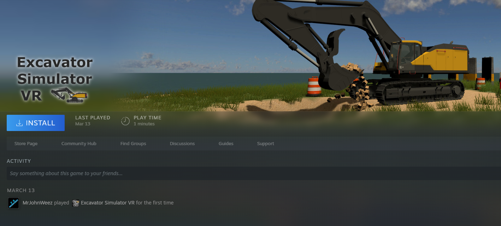
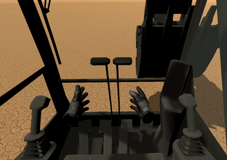
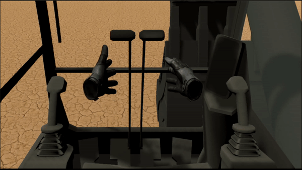

# Assignment 2 User documentation and Manual

Welcome to the user documentation for the app: Excavator Simulator VR. There is not a whole lot of documentation yet due to the app being actively developed. The guides below may be out of date and if so please submit a issue ticket.

- [Assignment 2 User documentation and Manual](#assignment-2-user-documentation-and-manual)
  - [Getting started](#getting-started)
    - [Hardware requirements](#hardware-requirements)
    - [Installation](#installation)
    - [Run Simulator App](#run-simulator-app)
  - [How to play Excavator Simulator VR](#how-to-play-excavator-simulator-vr)
    - [Navigating menus](#navigating-menus)
    - [Game Controls](#game-controls)
      - [Seat Controls](#seat-controls)
      - [Excavator Controls](#excavator-controls)
    - [Level Walk-throughs](#level-walk-throughs)
  - [FAQ](#faq)

## Getting started

### Hardware requirements
* SYSTEM REQUIREMENTS
  * MINIMUM:
    * OS: Windows 10
    * Processor: Intel i5-4590 | AMD Ryzen 5 1400
    * Memory: 8 GB RAM
    * Graphics: NVIDIA GTX 1060 | AMD Radeon RX 480
    * DirectX: Version 11
    * Storage: 1 GB available space
* RECOMMENDED:
    * OS: Windows 10
    * Processor: Intel Core i7-10750 | Ryzen 7 4800H
    * Memory: 16 GB RAM
    * Graphics: NVIDIA RTX 2060 | AMD Radeon Vega 56
    * DirectX: Version 11
    * Storage: 1 GB available space
* A VR device (Any device that works with Steam VR)

### Installation
1. Create a Steam account [Go to site](https://store.steampowered.com/login/?redir=&redir_ssl=1&snr=1_4_4__global-header)
2. Download and sign into Steam on a Windows 10 PC/Laptop [Download](https://store.steampowered.com/about/)
3. In the search bar type "Excavator Simulator VR" or view Steam page [Excavator Simulator VR](https://store.steampowered.com/app/1526380/Excavator_Simulator_VR/)
   
4. Hit add to cart and purchase (or add to wishlist if not available for purchase)
5. Download and install Steam VR [Download Steam VR](https://store.steampowered.com/app/250820/SteamVR/)
6. Download and install Excavator Simulator VR and press play
   

### Run Simulator App

1. Once Steam VR and Excavator Simulator VR has been installed just press play on Excavator Simulator VR
2. Steam VR should also start up

## How to play Excavator Simulator VR

### Navigating menus

*  *Gifs coming soon when menu is finished*

1. Press the in game menu button on your controller.
2. A menu will be displayed on the excavator windshield.
3. Point your controller at the menu and a pointer will appear coming out of your hand.
4. Find a menu item to press and pull the trigger to click.
5. Press the in game menu button on your controller again to exit the menu or press the X button on the in game HUD.
   
### Game Controls

#### Seat Controls
* *Coming soon...*

#### Excavator Controls

Hover controller hand over the joysticks or levers and a hint will show what button to press

When the grab button is held in your hands snap to the red highlighted object and you can move the controller around to move the joysticks or levers

*Diagrams coming soon once controls are finalized...*

* Levers
  * Left lever = left track
  * Right lever = right track
* Joysticks and corresponding control pattern (Toggleable in settings menu)
  * ISO and SAE control patterns
    * Left hand left = Swing left
    * Left hand right = Swing right
    * Right hand left = Bucket curl in (closed)
    * Right hand right = Bucket curl out (dump)
  * Just ISO
    * Left hand forward = Stick Boom (Dipper) away
    * Left hand back = Stick Boom (Dipper) close
    * Right hand forward = Main Boom down
    * Right hand back = Main Boom up.
  * Just SAE
    * Left hand forward = Main Boom down
    * Left hand back = Main Boom up
    * Right hand forward = Stick Boom (Dipper) away
    * Right hand back = Stick Boom (Dipper) close

### Level Walk-throughs

* *coming soon...*

## FAQ
Steam VR did not start up when Excavator Simulator VR app was started

* Make sure Steam VR has been installed and can be ran manually
* [Visit Steam VR's trouble shooting tips](https://support.steampowered.com/kb_article.php?ref=8566-SDZC-9326#:~:text=As%20a%20last%20resort%20for,Box%20cables%20from%20your%20PC.&text=Make%20sure%20the%20link%20box's,%2C%20and%20re%2Dlaunch%20SteamVR.)

I bought the game but it is laggy or unplayable

* Please create a community post or bug report with what hardware you are running

* If you do not want to wait for it to get fixed return the game to steam

I found a bug

* Please submit a bug report in the discussions tab
  
  
